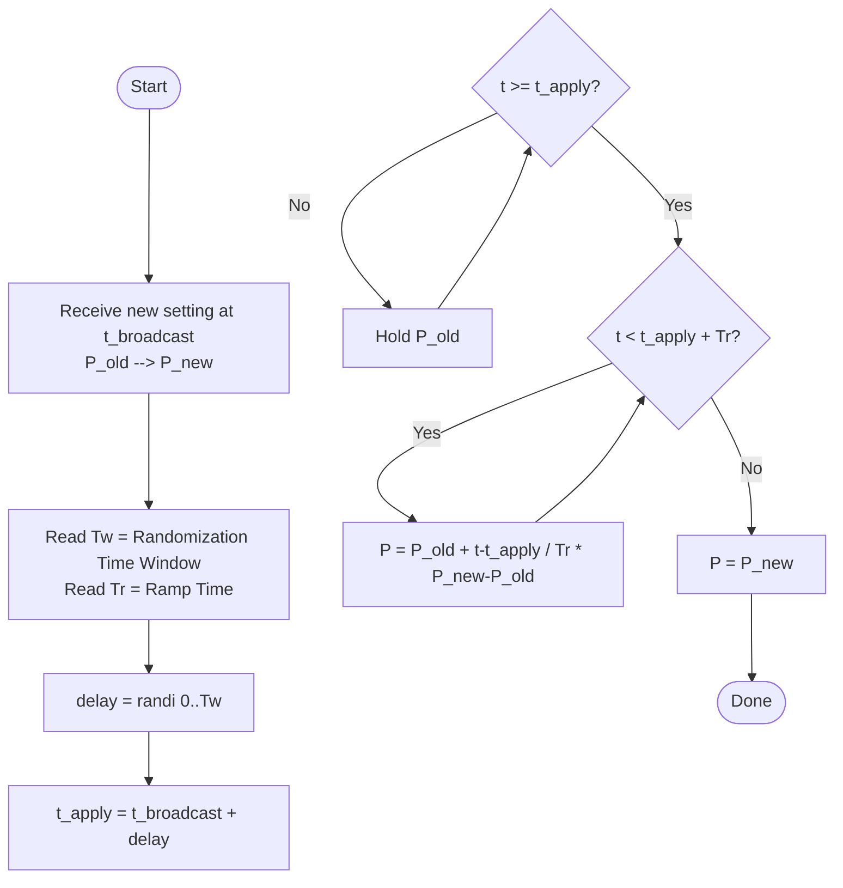
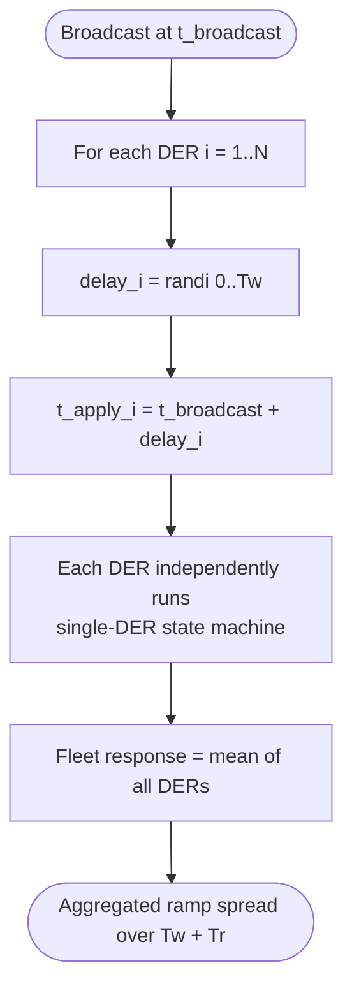
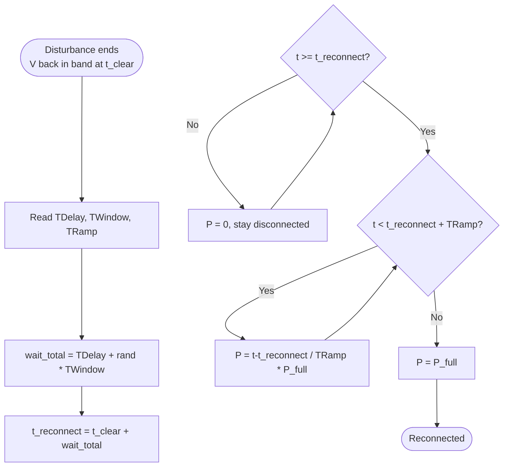

# Randomization Time Window — Flowchart

Based on EPRI 3002008217 *Common Functions for Smart Inverters*, 4th Ed.
Reference sections: §5 (Connect/Disconnect), §7–9 (Charge/Discharge), §16 (Reconnect).

## 1. Single DER — apply new setting

## 2. Fleet broadcast — N DERs receive same command

Effect: uniform delays in `[0, Tw]` desynchronize responses, avoiding
simultaneous step on feeder.

## 3. Reconnect after voltage/frequency disturbance — EPRI §16

## Parameter map

| Symbol | EPRI name | Section |
|---|---|---|
| `Tw` | Randomization Time Window / Time Window | §5, §7, §8, §9 |
| `Tr` | Ramp Time (Output/Input Inc/Dec) | §7, §8 |
| `TDelay` | TDelayShortReconnect / TDelayLongReconnect | §16 |
| `TWindow` | TWindowShortReconnect / TWindowLongReconnect | §16 |
| `TRamp` | TRampShortReconnect / TRampLongDisconnect | §16 |
